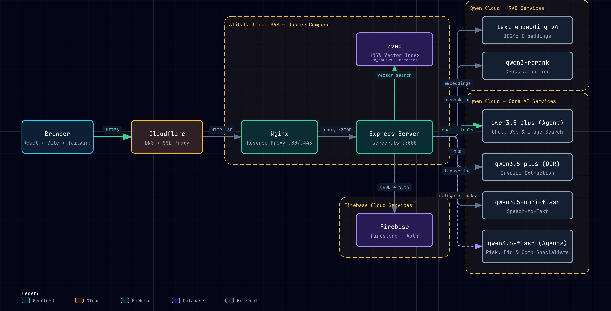

# Procurely — AI Procurement Agent

> An autonomous AI agent that handles the full procure-to-pay lifecycle using Qwen Cloud, from intake orchestration to vendor negotiation and payment processing.

**Track:** Autopilot Agent — Qwen Cloud Global AI Hackathon

## What It Does

Procurely is a procurement AI agent that automates real-world business workflows end-to-end. A user describes what they need in natural language, and the agent handles qualification, sourcing, policy enforcement, RFQ creation, bid analysis, and purchase order generation — with human approval at critical decision points.

### Key Features

- **Natural Language Procurement** — "I need 10 laptops for the engineering team under $15K" triggers an autonomous qualification and sourcing flow
- **KB Policy Enforcement** — Knowledge base policies are injected into the system prompt as mandatory rules; the agent refuses non-compliant requests and cites the specific policy
- **Multi-Agent Delegation** — Complex tasks are delegated to specialist sub-agents (risk analyst, bid optimizer, compliance checker) running on `qwen3.6-flash`
- **RAG-Powered Knowledge Base** — Documents are chunked, embedded with `text-embedding-v4`, stored in Zvec (HNSW index), and reranked with `qwen3-rerank`
- **Persistent Memory** — Agent remembers user preferences and past decisions across sessions using vector embeddings
- **Human-in-the-Loop** — Confirmation cards for supplier creation, RFQ submission, bid selection, and purchase orders
- **Vendor Negotiation** — AI-driven market research and counter-offer generation via web search
- **Voice Input** — Speech-to-text transcription using `qwen3.5-omni-flash`
- **Speech-to-Text** — Microphone input with real-time transcription into the chat
- **25 Agent Tools** — From catalog search to invoice OCR, the agent has a full procurement toolkit

## Architecture



```
┌─────────────────────────────────────────────────────────┐
│                    Frontend (React + Vite)                │
│  Dashboard │ Agent Chat │ Suppliers │ RFQs │ KB │ Workflows │
└──────────────────────────┬──────────────────────────────┘
                           │ HTTPS
┌──────────────────────────▼──────────────────────────────┐
│              Cloudflare (DNS + SSL Proxy)                │
│              procurely.dpdns.org                         │
└──────────────────────────┬──────────────────────────────┘
                           │ HTTP :80
┌──────────────────────────▼──────────────────────────────┐
│                 Nginx Reverse Proxy                      │
│                 Port 80/443 → 3000                       │
└──────────────────────────┬──────────────────────────────┘
                           │
┌──────────────────────────▼──────────────────────────────┐
│              Express Server (server.ts :3000)            │
│                                                          │
│  ┌─────────────┐  ┌──────────────┐  ┌────────────────┐  │
│  │ Agent Chat   │  │ RAG Pipeline │  │ Tool Execution │  │
│  │ (streaming)  │  │ (Zvec +      │  │ (25 tools)     │  │
│  │              │  │  rerank)     │  │                │  │
│  └──────┬───────┘  └──────┬───────┘  └───────┬────────┘  │
│         │                 │                   │           │
│  ┌──────▼───────┐  ┌─────▼─────┐             │           │
│  │ Transcribe   │  │   Zvec    │             │           │
│  │ (speech→text)│  │ HNSW Index│             │           │
│  └──────────────┘  └───────────┘             │           │
└─────────┼─────────────────┼───────────────────┼──────────┘
          │                 │                   │
    ┌─────▼─────┐    ┌─────▼─────┐      ┌──────▼──────┐
    │Qwen Cloud  │    │Firebase   │      │  Alibaba    │
    │6 Models    │    │Auth +     │      │  Cloud SAS  │
    │14+ API     │    │Firestore  │      │  (Docker)   │
    │calls       │    │           │      │             │
    └───────────┘    └───────────┘      └─────────────┘
```

## Qwen Cloud Integration

Procurely uses **6 Qwen Cloud models** across **14+ API calls**:

| Model | Purpose | API Calls |
|-------|---------|-----------|
| `qwen3.5-plus` | Chat, tool calling, web search, vision, negotiation | Chat completions, web search, vision OCR, document classification |
| `qwen3.6-flash` | Specialist sub-agent tasks (risk, bid, compliance) | Delegated analysis calls |
| `text-embedding-v4` | Document and query vectorization (1024d) | Embeddings API |
| `qwen3-rerank` | Cross-attention reranking for RAG precision | Reranking API |
| `qwen3.5-omni-flash` | Speech-to-text transcription | Audio input processing |
| `enable_search` | Real-time supplier and market research | Web search via chat completions |

## Getting Started

```bash
# Install dependencies
pnpm install

# Set up environment
cp .env.example .env
# Add your QWEN_API_KEY

# Start development server
pnpm dev
```

The app runs at `http://localhost:3000`. Sign in with Firebase Auth. On first login, demo data is auto-seeded.

## Demo Flow

1. **Dashboard** — View spend analytics, recent approvals, procurement pipeline
2. **Agent Chat** — "I want to order a laptop for $20,000" → agent refuses, cites KB policy
3. **Qualification** — "Find me a laptop under $2000" → interactive chips → product cards with source badges (Online vs Catalog)
4. **Intake Creation** — Agent creates requisition → confirmation card → persists to Firestore
5. **Supplier Directory** — View suppliers with risk badges, compliance status
6. **Online Supplier Search** — Agent searches the web for new suppliers not in the database
7. **RFQs & Bids** — RFQ with multiple supplier bids, comparative analysis
8. **Knowledge Base** — Upload policies, toggle KB context for agent
9. **Vendor Negotiation** — AI-driven market research and counter-offers
10. **Speech-to-Text** — Click mic button, speak your request, text appears in input

## Tech Stack

| Layer | Technology |
|-------|-----------|
| Frontend | React 19, Vite, Tailwind CSS, shadcn/ui |
| Backend | Express.js, TypeScript |
| AI | Qwen Cloud (6 models, 14+ API calls) |
| Vector DB | Zvec (in-process, HNSW index) |
| Database | Firebase Firestore |
| Auth | Firebase Authentication |
| Hosting | Alibaba Cloud SAS (Docker Compose) |
| CDN/SSL | Cloudflare (Flexible SSL) |
| Domain | procurely.dpdns.org (DigitalPlat free domain) |

## Project Structure

```
src/
├── pages/          # React page components
│   ├── AgentChat.tsx    # Main agent chat interface
│   ├── Dashboard.tsx    # Procurement dashboard
│   ├── Requisitions.tsx # Purchase requisitions
│   ├── Suppliers.tsx    # Supplier directory
│   ├── RFQs.tsx         # Requests for quotation
│   └── ...
├── components/     # Reusable UI components
│   └── agent/      # Agent-specific cards (BidMatrix, SupplierForm, etc.)
├── lib/            # Core logic
│   ├── agent-tools.ts   # 25 tool definitions
│   ├── agent-prompts.ts # Specialist agent prompts
│   ├── rag.ts           # RAG pipeline (embed + rerank)
│   ├── zvec-store.ts    # Zvec vector search
│   ├── auth-context.tsx  # Firebase auth
│   └── data-context.tsx  # Firestore data
server.ts           # Express server with all API endpoints
docs/
├── procurely-architecture.html  # Interactive architecture diagram
└── architecture.md              # Architecture documentation
```

## License

MIT
