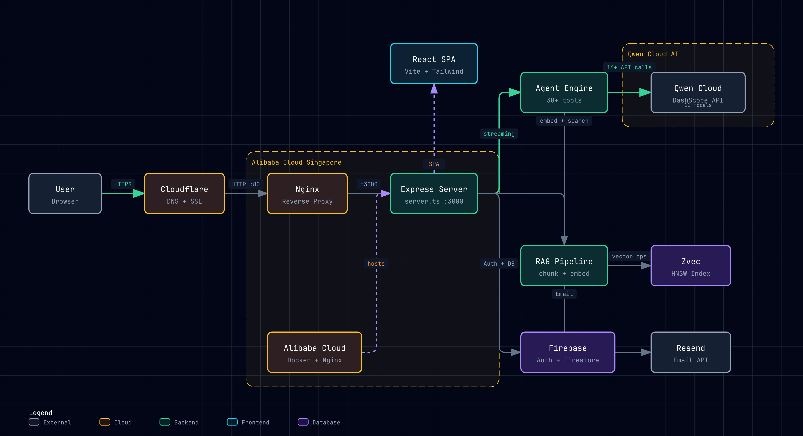

<p align="center">
  <a href="https://procurely.dpdns.org">
    
  </a>
</p>

<h3 align="center">Procurely</h3>

<p align="center">
  An autonomous AI procurement agent that handles the full procure-to-pay lifecycle using Qwen Cloud.
  <br>
  <a href="https://procurely.dpdns.org"><strong>Live Demo »</strong></a>
  <br>
  <br>
  <a href="#getting-started">Getting Started</a>
  ·
  <a href="#features">Features</a>
  ·
  <a href="#architecture">Architecture</a>
  ·
  <a href="#demo-flow">Demo</a>
</p>

<p align="center">
  
  
  
  
</p>

---

## What It Does

Procurely is a procurement AI agent that automates real-world business workflows end-to-end. A user describes what they need in natural language, and the agent handles qualification, sourcing, policy enforcement, RFQ creation, bid analysis, and purchase order generation — with human approval at critical decision points.

## Table of Contents

- [Features](#features)
- [Quick Start](#quick-start)
- [Architecture](#architecture)
- [Qwen Cloud Integration](#qwen-cloud-integration)
- [Demo Flow](#demo-flow)
- [Tech Stack](#tech-stack)
- [Project Structure](#project-structure)
- [Environment Variables](#environment-variables)
- [License](#license)

## Features

| Feature | Description |
|---------|-------------|
| **Natural Language Procurement** | "I need 10 laptops for engineering under $15K" triggers autonomous qualification and sourcing |
| **Visual Workflow Designer** | Drag-and-drop builder with custom procurement nodes, event triggers, and execution logs |
| **KB Policy Enforcement** | Policies injected into system prompt as mandatory rules; agent refuses non-compliant requests |
| **Multi-Agent Delegation** | Complex tasks delegated to specialist sub-agents (risk, bid, compliance) on `qwen3.6-flash` |
| **RAG-Powered Knowledge Base** | Documents chunked, embedded with `text-embedding-v4`, stored in Zvec, reranked with `qwen3-rerank` |
| **Persistent Memory** | Agent remembers preferences and past decisions across sessions via vector embeddings |
| **Human-in-the-Loop** | Confirmation cards for supplier creation, RFQ submission, bid selection, and purchase orders |
| **Vendor Negotiation** | AI-driven market research and counter-offer generation via web search |
| **Voice Input** | Speech-to-text transcription using `qwen3.5-omni-flash` |
| **Email Integration** | PO notifications, approval requests, RFQ quotes via Resend |

## Quick Start

```bash
# Clone the repo
git clone https://github.com/albertnjobo/procurely.git
cd procurely

# Install dependencies
npm install

# Set up environment
cp .env.example .env
# Add your QWEN_API_KEY and RESEND_API_KEY

# Start development server
npm run dev
```

The app runs at `http://localhost:3000`. Sign in with Firebase Auth. On first login, demo data is auto-seeded.

## Architecture

<p align="center">
  
</p>

```
┌─────────────────────────────────────────────────────────┐
│                    Frontend (React + Vite)                │
│  Dashboard │ Agent Chat │ Suppliers │ RFQs │ KB │ Workflows │
└──────────────────────────┬──────────────────────────────┘
                           │ HTTPS
┌──────────────────────────▼──────────────────────────────┐
│              Cloudflare (DNS + SSL Proxy)                │
│              procurely.dpdns.org                         │
└──────────────────────────┬──────────────────────────────┘
                           │ HTTP :80
┌──────────────────────────▼──────────────────────────────┐
│                 Nginx Reverse Proxy                      │
│                 Port 80/443 → 3000                       │
└──────────────────────────┬──────────────────────────────┘
                           │
┌──────────────────────────▼──────────────────────────────┐
│              Express Server (server.ts :3000)            │
│                                                          │
│  ┌─────────────┐  ┌──────────────┐  ┌────────────────┐  │
│  │ Agent Chat   │  │ RAG Pipeline │  │ Tool Execution │  │
│  │ (streaming)  │  │ (Zvec +      │  │ (30+ tools)    │  │
│  │              │  │  rerank)     │  │                │  │
│  └──────┬───────┘  └──────┬───────┘  └───────┬────────┘  │
│         │                 │                   │           │
│  ┌──────▼───────┐  ┌─────▼─────┐             │           │
│  │ Transcribe   │  │   Zvec    │             │           │
│  │ (speech→text)│  │ HNSW Index│             │           │
│  └──────────────┘  └───────────┘             │           │
└─────────┼─────────────────┼───────────────────┼──────────┘
          │                 │                   │
    ┌─────▼─────┐    ┌─────▼─────┐      ┌──────▼──────┐
    │Qwen Cloud  │    │Firebase   │      │  Resend     │
    │11 Models   │    │Auth +     │      │  Email API  │
    │14+ API     │    │Firestore  │      │             │
    │calls       │    │           │      │             │
    └───────────┘    └───────────┘      └─────────────┘
```

> Open `docs/architecture.html` in your browser for an interactive version with dark/light theme and export options.

## Qwen Cloud Integration

Procurely uses **11 AI models** across **14+ API calls**:

| Model | Purpose | API |
|-------|---------|-----|
| `qwen3.7-max` | Maximum performance tasks | Complex reasoning |
| `qwen3.5-plus` | Chat, tool calling, web search, vision, negotiation | Chat completions, web search, vision OCR |
| `qwen3.6-flash` | Specialist sub-agent tasks (risk, bid, compliance) | Delegated analysis |
| `text-embedding-v4` | Document and query vectorization (1024d) | Embeddings API |
| `qwen3-rerank` | Cross-attention reranking for RAG precision | Reranking API |
| `qwen3.5-omni-flash` | Speech-to-text transcription | Audio input |

## Demo Flow

1. **Dashboard** — View spend analytics, recent approvals, procurement pipeline
2. **Agent Chat** — "I want to order a laptop for $20,000" → agent refuses, cites KB policy
3. **Qualification** — "Find me a laptop under $2000" → interactive chips → product cards
4. **Intake Creation** — Agent creates requisition → confirmation card → persists to Firestore
5. **Supplier Directory** — View suppliers with risk badges, compliance status
6. **RFQs & Bids** — RFQ with multiple supplier bids, comparative analysis
7. **Knowledge Base** — Upload policies, toggle KB context for agent
8. **Vendor Negotiation** — AI-driven market research and counter-offers
9. **Workflow Designer** — Build custom procurement workflows visually
10. **Email Notifications** — Send POs, approvals, RFQs via Resend

## Tech Stack

| Layer | Technology |
|-------|-----------|
| Frontend | React 19, Vite, Tailwind CSS, shadcn/ui, ReactFlow |
| Backend | Express.js, TypeScript |
| AI | Qwen Cloud (11 models, 14+ API calls) |
| Vector DB | Zvec (in-process, HNSW index) |
| Database | Firebase Firestore |
| Auth | Firebase Authentication |
| Email | Resend |
| Hosting | Alibaba Cloud (Docker Compose) |
| CDN/SSL | Cloudflare |

## Project Structure

```
src/
├── pages/                  # React page components
│   ├── AgentChat.tsx       # Main agent chat interface
│   ├── Dashboard.tsx       # Procurement dashboard
│   ├── Requisitions.tsx    # Purchase requisitions
│   ├── Suppliers.tsx       # Supplier directory
│   ├── RFQs.tsx            # Requests for quotation
│   └── WorkflowDesigner.tsx
├── components/             # Reusable UI components
│   └── agent/              # Agent-specific cards
├── emails/                 # React Email templates
├── lib/                    # Core logic
│   ├── agent-tools.ts      # 30+ tool definitions
│   ├── tool-executor.ts    # Tool execution engine
│   ├── rag.ts              # RAG pipeline
│   ├── zvec-store.ts       # Vector search
│   └── workflow-engine.ts  # Workflow execution
├── routes/                 # Express API routes
│   ├── agent.ts            # Agent chat endpoint
│   ├── kb.ts               # Knowledge base endpoints
│   └── memory.ts           # Memory endpoints
server.ts                   # Express server entry
```

## Environment Variables

```env
QWEN_API_KEY=sk-your-qwen-api-key
RESEND_API_KEY=re_your-resend-api-key
RESEND_FROM_EMAIL=Procurely <notifications@procurely.dpdns.org>
APP_URL=http://localhost:3000
```

## License

MIT © [Lawrence Njobo](https://github.com/albertnjobo)
