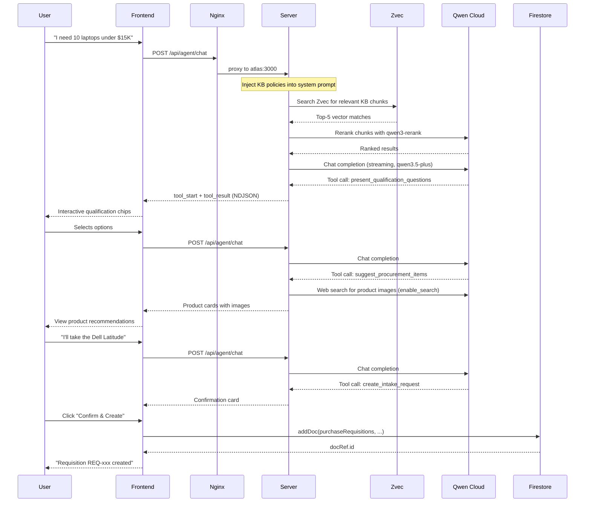
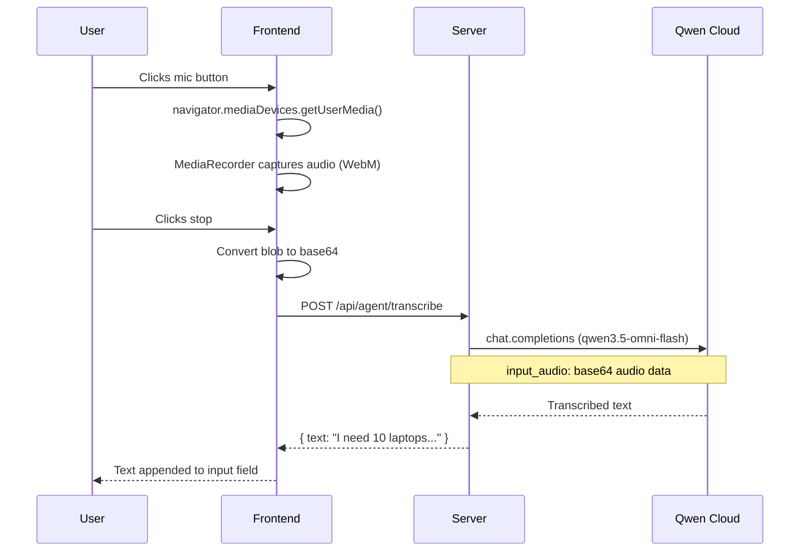
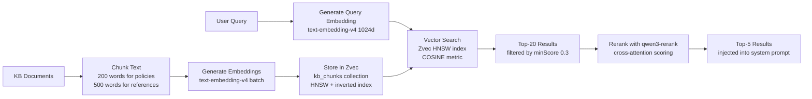
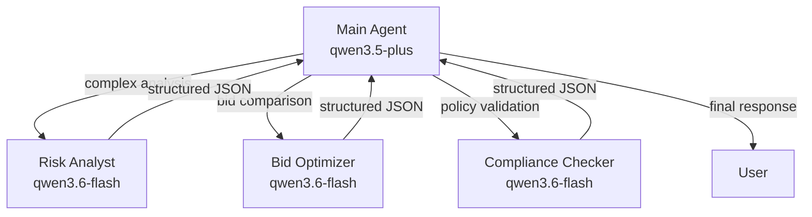

# Procurely Architecture

## System Overview

```mermaid
graph TB
    subgraph Browser["Browser — React + Vite + Tailwind"]
        UI[Dashboard / Agent Chat / Suppliers / RFQs / Requisitions / Request Tracker / Vendor Portal / Workflow Designer / KB]
        MIC[Mic Button<br/>Speech-to-Text]
    end

    subgraph Alibaba["Alibaba Cloud SAS — Docker"]
        subgraph Docker["Docker Compose"]
            NGINX[Nginx Reverse Proxy<br/>port 80/443]
            subgraph App["Node.js App — server.ts"]
                Agent[Agent Chat Endpoint<br/>streaming NDJSON]
                RAG[RAG Pipeline<br/>Zvec vector search + rerank]
                Tools[Tool Execution<br/>25 tools]
                Memory[Memory Service<br/>cross-session recall]
                Transcribe[Transcribe Endpoint<br/>/api/agent/transcribe]
            end
        end
        ZVEC[(Zvec<br/>kb_chunks + agent_memories<br/>HNSW vector index)]
    end

    subgraph Cloudflare["Cloudflare — DNS + SSL"]
        DNS[procurely.dpdns.org<br/>proxy + HTTPS]
    end

    subgraph QwenCloud["Qwen Cloud — DashScope API"]
        subgraph RAGServices["RAG Services"]
            Embed[text-embedding-v4<br/>1024d Vectors]
            Rerank[qwen3-rerank<br/>Cross-Attention Reranking]
        end
        subgraph CoreAIServices["Core AI Services"]
            Chat[qwen3.5-plus (Agent)<br/>Chat, Web & Image Search]
            Vision[qwen3.5-plus (OCR)<br/>Invoice Extraction]
            Speech[qwen3.5-omni-flash<br/>Speech-to-Text]
            Flash[qwen3.6-flash (Agents)<br/>Risk, Bid & Comp Specialists]
        end
    end

    subgraph Firebase["Firebase"]
        Auth[Authentication]
        FS[(Firestore<br/>suppliers / purchaseRequisitions / rfqs / bids<br/>purchaseOrders / goodsReceipts / invoices<br/>procurementCatalog / knowledgeBase / users / agentMemory)]
    end

    subgraph Specialist["Multi-Agent System"]
        Risk[Risk Analyst<br/>qwen3.6-flash]
        Bid[Bid Optimizer<br/>qwen3.6-flash]
        Compliance[Compliance Checker<br/>qwen3.6-flash]
    end

    DNS --> NGINX
    NGINX --> Agent
    UI -->|HTTP POST| DNS
    UI -->|Microphone| MIC
    MIC -->|base64 audio| Transcribe
    Transcribe -->|transcribed text| Agent
    Agent -->|streaming NDJSON| UI
    Agent --> Chat
    Chat -->|tool_calls| Tools
    Tools --> FS
    Tools --> Vision
    Tools --> Flash
    RAG --> Embed
    RAG --> Rerank
    Agent --> RAG
    RAG --> ZVEC
    Memory --> ZVEC
    Flash --> Risk
    Flash --> Bid
    Flash --> Compliance
    Transcribe --> Speech
    UI --> Auth
    Auth --> FS
```

## Qwen Cloud API Usage Map

| API Endpoint | Model | Used By | Purpose |
|-------------|-------|---------|---------|
| `/chat/completions` | qwen3.5-plus | Agent Chat | Main agent reasoning + tool calling |
| `/chat/completions` | qwen3.5-plus | evaluate_supplier_risk | AI risk assessment with web search |
| `/chat/completions` | qwen3.5-plus | generate_bid_matrix | Comparative bid analysis |
| `/chat/completions` | qwen3.5-plus | suggest_procurement_items | Product research + web search |
| `/chat/completions` | qwen3.5-plus | negotiate_with_vendor | Market research + negotiation strategy |
| `/chat/completions` | qwen3.5-plus | research_market_price | Pricing research |
| `/chat/completions` | qwen3.5-plus | process_invoice | Invoice OCR via vision |
| `/chat/completions` | qwen3.5-plus | documents/classify | Document classification + summary |
| `/chat/completions` | qwen3.5-plus | memory/summarize | Conversation summarization |
| `/chat/completions` | qwen3.6-flash | delegate_to_specialist | Sub-agent specialist tasks |
| `/embeddings` | text-embedding-v4 | RAG Pipeline | 1024d document + query embeddings |
| `/reranks` | qwen3-rerank | RAG Pipeline | Cross-attention result reranking |
| `/chat/completions` | qwen3.5-omni-flash | /api/agent/transcribe | Speech-to-text transcription |
| `/responses` | qwen3.5-plus | Agent Responses API | Web extractor + image search |

## Data Flow — Agent Chat



## Data Flow — Speech-to-Text



## RAG Pipeline (Zvec-powered)



## Multi-Agent Delegation



## Firestore Collections

| Collection | Purpose | Key Fields |
|------------|---------|------------|
| `suppliers` | Supplier directory | name, category, risk, status, compliance, userId |
| `purchaseRequisitions` | Procurement intake & requisitions | title, department, status, totalAmount, auditTrail, createdBy |
| `rfqs` | Requests for Quotation | title, description, supplierIds, dueDate, status, createdBy |
| `bids` | Supplier bid responses | rfqId, vendorId, amount, proposal, status, reasoning |
| `purchaseOrders` | Committed purchases | supplierId, items, totalAmount, status, rfqId |
| `goodsReceipts` | Delivery confirmation records | purchaseOrderId, itemsReceived, status, receivedAt |
| `invoices` | Extracted invoice document records | purchaseOrderId, supplierId, items, totalAmount, parsedFields, status |
| `procurementCatalog` | Seeded directory of standard items | name, description, sku, category, price, imageUrl, rating |
| `knowledgeBase` | Corporate policies and standard procedures | title, content, category, userId |
| `users` | User accounts and profiles | uid, email, displayName, role |
| `agentMemory` | Chat companion memory contexts | userId, content, type, createdAt |
| `audit_events` | Traceable logs of procurement actions | action, userId, entityId, details, timestamp |
| `userChats` | Chat session history threads | userId, conversationId, messages, updatedAt |

## Zvec Collections

| Collection | Purpose | Schema |
|------------|---------|--------|
| `kb_chunks` | Knowledge base vectors | docId (STRING, INVERT index), title, text, embedding (FP32 1024d, HNSW COSINE) |
| `agent_memories` | Cross-session memory | userId (STRING, INVERT index), type, content, metadata, embedding (FP32 1024d, HNSW COSINE) |

## Infrastructure

| Layer | Technology | Purpose |
|-------|-----------|---------|
| Domain | procurely.dpdns.org | Free domain via DigitalPlat |
| CDN/SSL | Cloudflare (Flexible) | DNS proxy, HTTPS termination |
| Reverse Proxy | Nginx (Docker) | Port 80/443 → 3000, SSE streaming |
| App Server | Node.js + Express | API routes, agent chat, RAG |
| Vector DB | Zvec (in-process) | HNSW vector search, WAL persistence |
| Database | Firebase Firestore | Structured data, auth, real-time sync |
| AI | Qwen Cloud (DashScope) | Chat, embeddings, reranking, vision, speech, web search |
| Hosting | Alibaba Cloud SAS | Docker container, 2 vCPU, 2 GiB |
