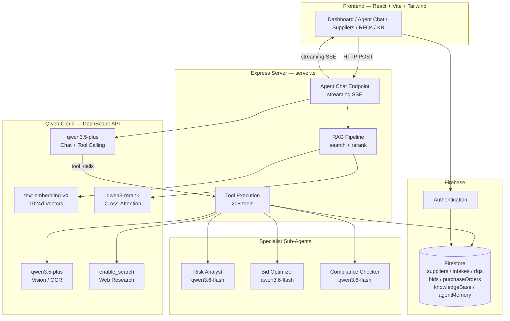
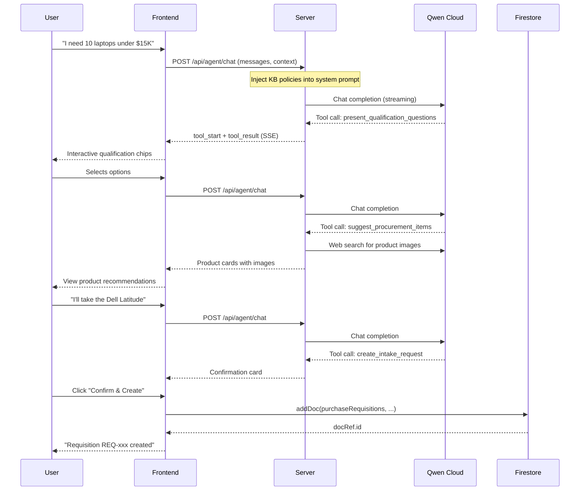
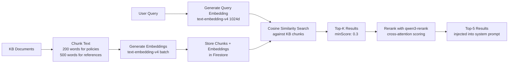
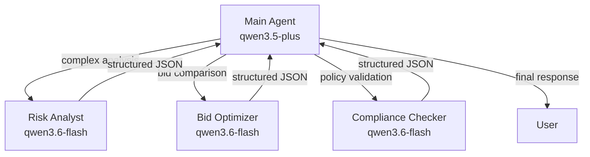

# Atlas Architecture

## System Overview

## Data Flow — Agent Chat

## RAG Pipeline

## Multi-Agent Delegation

## Firestore Collections

| Collection | Purpose | Key Fields |
|------------|---------|------------|
| `suppliers` | Supplier directory | name, category, risk, status, compliance |
| `purchaseRequisitions` | Intake requests | title, department, status, totalAmount, auditTrail |
| `rfqs` | Requests for Quotation | title, description, supplierIds, dueDate, status |
| `bids` | Supplier bid responses | rfqId, vendorId, amount, proposal, status |
| `purchaseOrders` | Committed purchases | supplierId, items, totalAmount, status |
| `knowledgeBase` | Policies & documents | title, content, category, chunks (with embeddings) |
| `agentMemory` | Cross-session memory | type, content, embedding, metadata |
