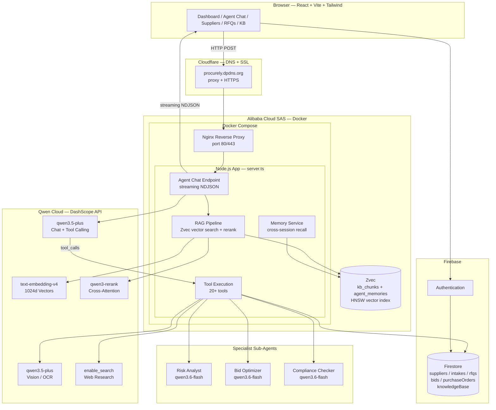
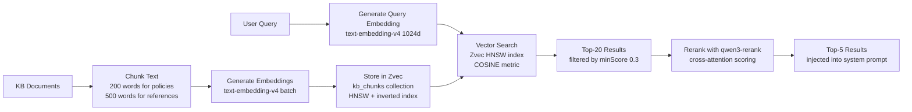
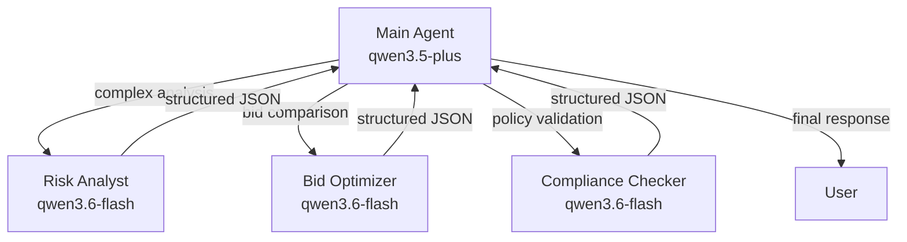

# Procurely Architecture

## System Overview

## Data Flow — Agent Chat

## RAG Pipeline (Zvec-powered)

## Multi-Agent Delegation

## Firestore Collections

| Collection | Purpose | Key Fields |
|------------|---------|------------|
| `suppliers` | Supplier directory | name, category, risk, status, compliance |
| `purchaseRequisitions` | Intake requests | title, department, status, totalAmount, auditTrail |
| `rfqs` | Requests for Quotation | title, description, supplierIds, dueDate, status |
| `bids` | Supplier bid responses | rfqId, vendorId, amount, proposal, status |
| `purchaseOrders` | Committed purchases | supplierId, items, totalAmount, status |
| `knowledgeBase` | Policies & documents | title, content, category |
| `users` | User profiles | uid, email, displayName, role |

## Zvec Collections

| Collection | Purpose | Schema |
|------------|---------|--------|
| `kb_chunks` | Knowledge base vectors | docId (STRING, INVERT index), title, text, embedding (FP32 1024d, HNSW COSINE) |
| `agent_memories` | Cross-session memory | userId (STRING, INVERT index), type, content, metadata, embedding (FP32 1024d, HNSW COSINE) |

## Infrastructure

| Layer | Technology | Purpose |
|-------|-----------|---------|
| Domain | procurely.dpdns.org | Free domain via DigitalPlat |
| CDN/SSL | Cloudflare (Flexible) | DNS proxy, HTTPS termination |
| Reverse Proxy | Nginx (Docker) | Port 80/443 → 3000, SSE streaming |
| App Server | Node.js + Express | API routes, agent chat, RAG |
| Vector DB | Zvec (in-process) | HNSW vector search, WAL persistence |
| Database | Firebase Firestore | Structured data, auth, real-time sync |
| AI | Qwen Cloud (DashScope) | Chat, embeddings, reranking, vision, web search |
| Hosting | Alibaba Cloud SAS | Docker container, 2 vCPU, 2 GiB |
